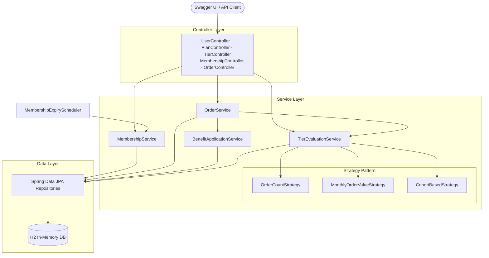
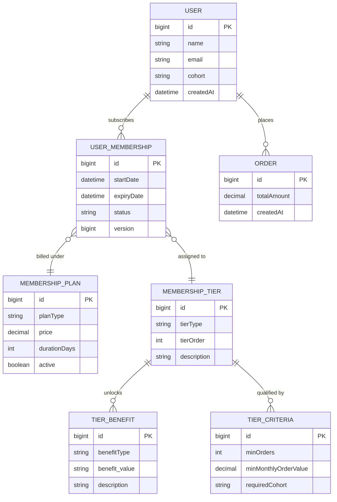
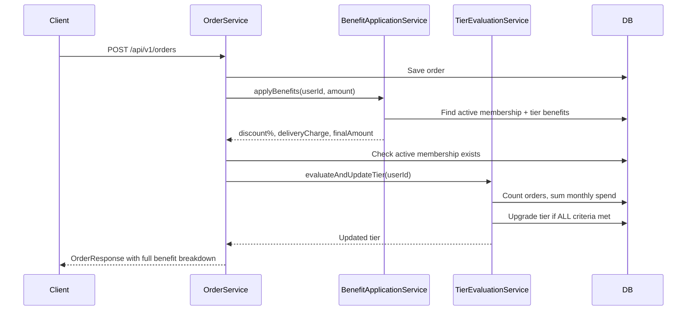

# FirstClub Membership Program

[](https://github.com/Kit105/fc-membership/actions/workflows/ci.yml)


Backend system for a **subscription-based Membership Program with tiered benefits**, built with Java 21 and Spring Boot. Users subscribe to plans, earn tier promotions automatically based on shopping activity, and receive configurable benefits applied live at checkout.

**🔗 Live API:** `https://fc-membership-production.up.railway.app/`

---

## Architecture



---

## Entity Design



---

## Order & Benefit Flow



---

## Features

- **3 subscription plans** — Monthly (₹299), Quarterly (₹699), Yearly (₹2499)
- **3 membership tiers** — Silver → Gold → Platinum, each unlocking richer perks
- **Configurable benefits** — discounts, free delivery, early access, priority support stored as data rows, not code
- **Auto-assign tier on subscribe** — system evaluates and picks the best eligible tier automatically
- **AND-based tier promotion** — all criteria must be met simultaneously (order count AND monthly spend)
- **Benefit application at checkout** — discount and delivery fee calculated live on every order
- **Eligible-tier endpoint** — check what tier a user qualifies for without triggering any changes
- **Optimistic locking** — `@Version` on `UserMembership` prevents concurrent write corruption
- **Auto-retry on conflicts** — `@Retryable` transparently retries on optimistic lock clashes
- **Expiry scheduler** — background job marks overdue memberships as EXPIRED every hour
- **16 automated tests** — unit, integration, and concurrency coverage

---

## Tech Stack

| Layer | Technology |
|---|---|
| Language | Java 21 |
| Framework | Spring Boot 4.x |
| Persistence | Spring Data JPA + H2 (in-memory) |
| Validation | Spring Boot Validation |
| API Docs | SpringDoc OpenAPI (Swagger UI) |
| Retry | Spring Retry |
| Build | Maven |
| Tests | JUnit 5 · AssertJ · Spring Boot Test |
| CI/CD | GitHub Actions + Railway |

---

## Quick Start

**Prerequisites:** JDK 21+

```bash
git clone https://github.com/Kit105/fc-membership.git
cd fc-membership
./mvnw spring-boot:run
```

| URL | Description |
|---|---|
| `http://localhost:8080/swagger-ui.html` | Interactive API docs |
| `http://localhost:8080/h2-console` | DB browser |

**H2 Console connection:**
- JDBC URL: `jdbc:h2:mem:membershipdb`
- Username: `fcadmin`
- Password: *(blank)*

---

## Seed Data

The app seeds all reference data on every startup automatically.

**Plans**

| ID | Type | Price | Duration |
|---|---|-------|---|
| 1 | MONTHLY | ₹299  | 30 days |
| 2 | QUARTERLY | ₹699  | 90 days |
| 3 | YEARLY | ₹2499 | 365 days |

**Tiers**

| ID | Tier | Criteria | Key Benefits |
|---|---|---|---|
| 1 | SILVER | Everyone qualifies | Free delivery (orders > ₹500), 5% discount |
| 2 | GOLD | ≥ 5 total orders | Free delivery, 10% discount, early sale access |
| 3 | PLATINUM | ≥ 10 orders **AND** ≥ ₹5000 monthly spend | Free delivery, 15% discount, ₹500 coupon, priority support |

**Users**

| ID | Name | Cohort |
|---|---|---|
| 1 | Arjun Sharma | REGULAR |
| 2 | Priya Mehta | PREMIUM_COHORT |
| 3 | Ravi Patel | CORPORATE |

---

## Demo Walkthrough

```bash
# 1. Browse catalogue
GET /api/v1/plans
GET /api/v1/tiers

# 2. Subscribe user 1 — auto-assigns SILVER (no tierId needed)
POST /api/v1/users/1/membership/subscribe
{ "planId": 1 }

# 3. Check active membership and expiry
GET /api/v1/users/1/membership

# 4. Check what tier user currently qualifies for
GET /api/v1/users/1/membership/eligible-tier
→ { "eligibleTier": "SILVER", "upgradeAvailable": false }

# 5. Place 5 orders — benefits applied live, tier auto-upgrades on 5th
POST /api/v1/orders   (repeat 5 times)
{ "userId": 1, "totalAmount": 500 }
→ response includes:
  "discountApplied": 25,
  "deliveryCharge": 0,
  "finalAmount": 475,
  "appliedBenefits": ["5% membership discount", "Free delivery"]
  "updatedTier": "GOLD"   ← appears on 5th order

# 6. Eligible-tier now shows available upgrade
GET /api/v1/users/1/membership/eligible-tier
→ { "eligibleTier": "GOLD", "currentTier": "SILVER", "upgradeAvailable": true }

# 7. Manual upgrade
PUT /api/v1/users/1/membership/upgrade

# 8. Manual downgrade
PUT /api/v1/users/1/membership/downgrade

# 9. Cancel
DELETE /api/v1/users/1/membership/cancel

# 10. View full history
GET /api/v1/users/1/membership/history
```

---

## API Reference

### Users
| Method | Endpoint | Description |
|---|---|---|
| `POST` | `/api/v1/users` | Register a new user |
| `GET` | `/api/v1/users` | List all users |
| `GET` | `/api/v1/users/{userId}` | Get user by ID |

### Catalogue
| Method | Endpoint | Description |
|---|---|---|
| `GET` | `/api/v1/plans` | List all active plans |
| `GET` | `/api/v1/tiers` | List all tiers with benefits |

### Memberships
| Method | Endpoint | Description |
|---|---|---|
| `POST` | `/api/v1/users/{userId}/membership/subscribe` | Subscribe to a plan |
| `GET` | `/api/v1/users/{userId}/membership` | Get current membership |
| `GET` | `/api/v1/users/{userId}/membership/history` | Get full membership history |
| `GET` | `/api/v1/users/{userId}/membership/eligible-tier` | Check eligible tier (read-only) |
| `PUT` | `/api/v1/users/{userId}/membership/upgrade` | Upgrade to next tier |
| `PUT` | `/api/v1/users/{userId}/membership/downgrade` | Downgrade to previous tier |
| `DELETE` | `/api/v1/users/{userId}/membership/cancel` | Cancel membership |
| `POST` | `/api/v1/users/{userId}/membership/evaluate-tier` | Trigger tier re-evaluation |

### Orders
| Method | Endpoint | Description |
|---|---|---|
| `POST` | `/api/v1/orders` | Place an order (applies benefits + evaluates tier) |
| `GET` | `/api/v1/users/{userId}/orders` | Get order history |

---

## Key Design Decisions

### Strategy Pattern for tier evaluation
Each tier criterion is an independent `@Component` implementing `TierEligibilityStrategy`. Adding a new criterion requires creating one new class with zero changes to existing code — Open/Closed Principle in practice.

```
OrderCountStrategy       → checks total lifetime orders ≥ X
MonthlyOrderValueStrategy → checks current month spend ≥ Y  
CohortBasedStrategy      → checks user belongs to cohort Z
```

### AND semantics for tier promotion
All criteria attached to a tier must pass simultaneously. A user reaching PLATINUM needs both 10+ orders AND ₹5000 monthly spend. Strategies return `true` vacuously when a tier has no criterion of their type, making AND logic scale cleanly across all tiers.

### Optimistic locking with auto-retry
`UserMembership` carries a `@Version` field. Concurrent modifications detect the version mismatch and Spring Retry automatically retries up to 3 times with exponential backoff — no 409 errors surface to the client.

### Configurable benefits
Benefits and promotion criteria are database rows, not hardcoded flags. Changing Silver's discount from 5% to 8% is a single DB row update — no code change, no redeployment needed.

### Benefit application at checkout
Every order automatically applies the user's active tier benefits and returns a full breakdown — original amount, discount applied, delivery charge, and final payable amount — integrating the membership directly into the shopping journey.

---

## Tests

```bash
./mvnw test
```

```
TierEvaluationIntegrationTest       4 tests  — AND semantics verification
MembershipLifecycleIntegrationTest  8 tests  — full subscription lifecycle
MembershipConcurrencyTest           1 test   — concurrent writes via @Version
MembershipExpiryTest                2 tests  — expiry scheduler
FcMembershipApplicationTest         1 test   — context loads
─────────────────────────────────────────────
Total                              16 tests ✅
```

---

## Project Structure

```
src/main/java/com/firstclub/fc_membership/
├── config/           DataInitializer · OpenApiConfig
├── controller/       UserController · PlanController · TierController
│                     MembershipController · OrderController · RootController
├── dto/
│   ├── request/      CreateUserRequest · SubscribeMembershipRequest · PlaceOrderRequest
│   └── response/     ApiResponse · MembershipResponse · OrderResponse · ...
├── entity/           User · MembershipPlan · MembershipTier · TierBenefit
│                     TierCriteria · UserMembership · Order
├── enums/            PlanType · TierType · MembershipStatus · BenefitType · CohortType
├── exception/        GlobalExceptionHandler · MembershipException · ...
├── mapper/           MembershipMapper
├── repository/       5 Spring Data JPA interfaces
├── scheduler/        MembershipExpiryScheduler
└── service/
    ├── strategy/     TierEligibilityStrategy (interface)
    │                 OrderCountStrategy · MonthlyOrderValueStrategy · CohortBasedStrategy
    ├── MembershipService (interface) + MembershipServiceImpl
    ├── TierEvaluationService
    ├── BenefitApplicationService
    ├── OrderService
    └── UserService
```